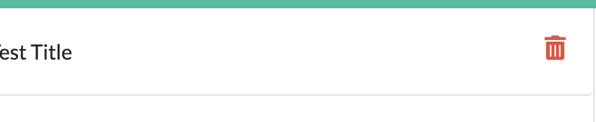

# Note-Taker

## Description

* Deployed application [HERE.](https://vast-dawn-30761.herokuapp.com/)

For users that need to keep track of a lot of information, it's easy to forget or be unable to recall something important. Being able to take persistent notes allows users to have written information available when needed. This app allows you to have your own digital note taker.

## Table of Contents
* [Usage](#usage)
* [Technologies](#technologies)
* [Contributing](#contributing)
* [License](#license)
* [Questions](#questions)

## Usage

* Gif:

* Instructions:

When clicking on the app link, you will see the main page with the button _**Get Started**_.

Press that button and you will be redirected to the actual note page.

Here you have to fields;
1. Left side - area, where all notes stored.
2. Right side - area, where you can write your notes.

When the title of the note and actual note's text entered, the icon **Save** will pop out at the right top corner. Press it and save your notes.

Press one of the saved notes and then the pencil icon - you can edit your note now.

If you want to delete notes - press the **Delete** icon.

## Technologies

This application utilizes `node.js`, `express.js`, *Heroku(to deploy app)*,  *API's*, `JSON`.

## Contributing

When contributing to this repository, please first discuss the change you wish to make via issue, email, or any other method with the owners of this repository before making a change.

### Steps for contributing
1. Fork it!
2. Create your feature branch: `git checkout -b my-new-feature`
3. Commit your changes: `git commit -am 'Add some feature'`
4. Push to the branch: `git push origin my-new-feature`
5. Submit a pull request.

## License

## Questions

If you have any questions or concerns, feel free to contact me via:

GitHub: [slugovoy](https://github.com/slugovoy)

Email: serg.lugovoy.81@gmail.com